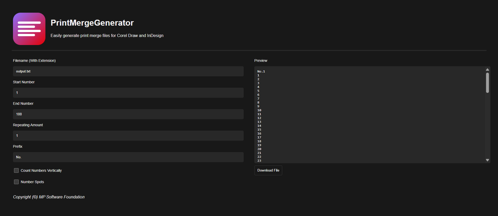

# PrintMergeGenerator

**PrintMergeGenerator** makes it super easy to create `.csv` and `.txt` files for CorelDRAW’s Print Merge feature — right from your browser!

## Overview

Whether you're cranking out name tags, event badges, or any mass-personalized design, PrintMergeGenerator is here to save you clicks and time. All in your browser, no installs needed!

**Preview Instantly**
See exactly what your output looks like before hitting that download button.

**Live Editing**
Every change you make is instantly reflected into that sweet preview.

**Blazingly Fast**
Implemented in Rust and WASM to generate rows and columns quick (we tested with over **1 million ranges**; no sweat!).

## Free & Open Source

No paywalls. No limitations. Just full-featured, open source goodness.
Licensed under the **GPL**, so you’re free to use, modify, and share.

👉 [Try it out here](https://mpsoftwarefoundation.github.io/PrintMergeGenerator/)
